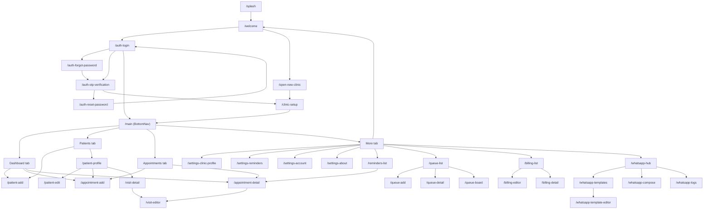

# App Flow Map (UI-First)

This file is the single source to understand:

- which button click triggers which controller method
- what route opens next
- what the expected result is after navigation

Keep this file updated whenever a new screen/CTA is added.

## 1) Route Tree

```text
/splash
  -> /welcome
    -> /auth-login
      -> /auth-forgot-password -> /auth-otp-verification -> /auth-reset-password -> /auth-login
      -> /auth-otp-verification (login flow) -> /clinic-setup -> /main
      -> /main
    -> /open-new-clinic -> /clinic-setup -> /main

/main (BottomNav)
  tabs:
    - Dashboard
    - Patients
    - Appointments
    - More

  patient routes:
    -> /patient-add
    -> /patient-profile
      -> /patient-edit
      -> /appointment-add
      -> /visit-detail

  appointment routes:
    -> /appointment-add
    -> /appointment-detail
      -> /visit-editor

  settings/reminders routes:
    -> /settings-clinic-profile
    -> /settings-reminders
    -> /settings-account
    -> /settings-about
    -> /reminders-list

  queue routes:
    -> /queue-list
      -> /queue-add
      -> /queue-detail
      -> /queue-board

  billing routes:
    -> /billing-list
      -> /billing-editor
      -> /billing-detail

  whatsapp routes:
    -> /whatsapp-hub
      -> /whatsapp-templates
        -> /whatsapp-template-editor
      -> /whatsapp-compose
      -> /whatsapp-logs

  visit routes:
    -> /visit-editor
    -> /visit-detail
      -> /visit-editor
```

## 2) Click -> Action -> Result Map

Format:
`Screen | UI Click | Controller.method | Navigation/Action | Result`

### Auth + Entry

- `Splash | Auto timer | SplashController._goNext | offNamed('/welcome') | lands on Welcome`
- `Welcome | Login To Clinic | WelcomeController.onLoginToClinic | toNamed('/auth-login') | opens Login`
- `Welcome | Open New Clinic | WelcomeController.onOpenNewClinic | toNamed('/open-new-clinic') | opens Clinic registration`
- `Login | Login button | AuthLoginController.onLoginPressed | offAllNamed('/main') | enters app`
- `Login | Forgot password | AuthLoginController.onForgotPassword | toNamed('/auth-forgot-password') | reset flow starts`
- `Login | Login with OTP | AuthLoginController.onLoginWithOtp | toNamed('/auth-otp-verification') | OTP flow starts`
- `Login | Open New Clinic link | AuthLoginController.onOpenNewClinic | offNamed('/open-new-clinic') | switch to signup`

### Dashboard

- `Dashboard | New Patient icon action | DashboardController.onAddPatient | toNamed('/patient-add') | add patient and refresh patients`
- `Dashboard | Book Visit icon action | DashboardController.onBookAppointment | toNamed('/appointment-add') | add appointment and refresh appointments`
- `Dashboard | Appointment card tap | DashboardController.onAppointmentTap | toNamed('/appointment-detail') | opens appointment details`

### Patients

- `Patients tab | Add Patient | PatientsTabController.onAddPatient | toNamed('/patient-add') | adds patient and refreshes list`
- `Patients tab | Patient list item tap | PatientsTabController.onPatientTap | toNamed('/patient-profile') | opens profile`
- `Patient Profile | Edit | PatientProfileController.onEdit | toNamed('/patient-edit') | edit and reload profile`
- `Patient Profile | Book Visit | PatientProfileController.onBookVisit | toNamed('/appointment-add') | prefilled appointment flow`
- `Patient Profile | Visit history card tap | PatientProfileController.onTapVisit | toNamed('/visit-detail') | opens saved visit summary`

### Appointments

- `Appointments tab | Book appointment | AppointmentsTabController.onBookAppointment | toNamed('/appointment-add') | add appointment`
- `Appointments tab | Appointment item tap | AppointmentsTabController.onAppointmentTap | toNamed('/appointment-detail') | opens detail`
- `Appointment Detail | Send reminder | AppointmentDetailController.onSendReminder | repository update + snackbar | marks reminder sent`
- `Appointment Detail | Mark complete/missed/cancel | AppointmentDetailController.onMarkCompleted/onMarkMissed/onCancel | repository status update | updates appointment state`
- `Appointment Detail | Visit notes | AppointmentDetailController.onVisitNotes | toNamed('/visit-editor') | create/edit visit note for this appointment`

### Visit Notes / Basic Prescription

- `Visit Editor | Save visit note | VisitEditorController.onSaveVisit | repository save + back(result:true) | record saved`
- `Visit Editor | Add medicine | VisitEditorController.onAddMedicine | local list update | medicine appears in prescription list`
- `Visit Editor | Remove medicine | VisitEditorController.onRemoveMedicine | local list update | medicine removed`
- `Visit Detail | Edit visit note | VisitDetailController.onEdit | toNamed('/visit-editor') | opens editor with existing values`

### More Tab -> Settings/Reminders/Queue/WhatsApp

- `More | Clinic profile | MoreTabController.onClinicProfile | toNamed('/settings-clinic-profile') | opens clinic profile settings`
- `More | Reminder settings | MoreTabController.onReminderSettings | toNamed('/settings-reminders') | opens reminder preferences`
- `More | Reminders list | MoreTabController.onRemindersList | toNamed('/reminders-list') | opens reminder log`
- `More | Queue management | MoreTabController.onQueue | toNamed('/queue-list') | opens queue module`
- `More | WhatsApp communication | MoreTabController.onWhatsApp | toNamed('/whatsapp-hub') | opens WhatsApp hub`
- `More | Account | MoreTabController.onAccount | toNamed('/settings-account') | account screen`
- `More | About | MoreTabController.onAbout | toNamed('/settings-about') | app info screen`
- `More | Logout | MoreTabController.onLogout | offAllNamed('/welcome') | exits to auth entry`

### Reminders

- `Reminders List | Reminder row tap | RemindersListController.onReminderTap | toNamed('/appointment-detail') | jumps to related appointment`
- `Reminders List | Retry action | RemindersListController.onRetry | repository retry + snackbar | failed reminder retried (mock)`

### Queue

- `Queue List | Add token | QueueListController.onAddToken | toNamed('/queue-add') | creates token and refreshes list`
- `Queue List | Live board | QueueListController.onOpenBoard | toNamed('/queue-board') | opens display board`
- `Queue List | Token row tap | QueueListController.onTokenTap | toNamed('/queue-detail') | opens token detail`

### Billing

- `More | Billing & receipts | MoreTabController.onBilling | toNamed('/billing-list') | opens billing module`
- `Billing List | Add receipt icon | BillingListController.onCreateReceipt | toNamed('/billing-editor') | starts invoice creation`
- `Billing List | Receipt row tap | BillingListController.onReceiptTap | toNamed('/billing-detail') | opens receipt details`
- `Visit Detail | Create receipt | VisitDetailController.onCreateReceipt | toNamed('/billing-editor') | prefilled billing from visit context`
- `Billing Editor | Add item | BillingEditorController.onAddLineItem | local list update | item added to invoice`
- `Billing Editor | Save receipt | BillingEditorController.onSave | repository save + back(result:true) | receipt stored`
- `Billing Detail | Edit receipt | BillingDetailController.onEdit | toNamed('/billing-editor') | opens editor with existing data`
- `Billing Detail | Share receipt | BillingDetailController.onShare | snackbar (mock) | share preview simulation`

### WhatsApp

- `WhatsApp Hub | Templates | WhatsAppHubController.onTemplates | toNamed('/whatsapp-templates') | templates screen`
- `WhatsApp Hub | Compose | WhatsAppHubController.onCompose | toNamed('/whatsapp-compose') | compose message flow`
- `WhatsApp Hub | Logs | WhatsAppHubController.onLogs | toNamed('/whatsapp-logs') | delivery logs`

## 3) Visual Mermaid Flowchart



## 4) Update Checklist (When New UI Is Added)

- add route constant in `lib/routes/app_routes.dart`
- add `GetPage` in `lib/routes/app_pages.dart`
- add controller handler method (`onXxxTap` / `onXxxPressed`)
- add one line in this file under:
  - Route Tree
  - Click -> Action -> Result Map

